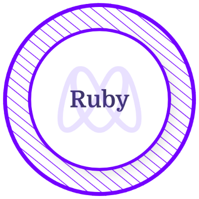
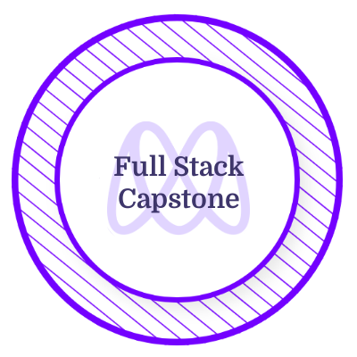

  

   

  

  <h1  style="color:#fff; font-size:30px;">
    Full Stack Developer
     
    𝐇𝐞𝐥𝐥𝐨 Developers
  </h1>

   
   

  <h1 style="color:#fff;">💫About Me :</h1>

  
Hello, I'm Ahmad Zaki Yousufi, a multi-skilled full-stack software developer with hands-on experience in developing and executing in a totally unstructured and resource-constrained environment. I specialize in building scalable web applications and have extensive knowledge in the following areas:

Front-end development: ReactJS | Javascript | Redux | Next.JS
Back-end development: NodeJS | ExpressJS | Python | Ruby on Rails
Databases: PostgreSQL | MongoDB | SQLite | PostgreSQL
Styling: CSS3 | Bootstrap | TailwindCSS | SCSS | MaterialUI | Styled Component
Tools and Methods: Git, GitFlow, GitHub, Responsive Design, Postman, RapidAPI.
QA: Unit Testing | RSpec | TDD | Chrome Dev Tool.
Infra: Vercel | CI/CD | Netlify
Professional: Remote pair programming, Teamwork, Mentoring, Communication, and Collaboration.
I'm deeply passionate about ideation, conceptualization, and creating high-quality codes from start to finish. I have a proven track record of delivering successful projects. I'm always looking for new challenges and opportunities to use my skills and knowledge to help businesses of all sizes achieve their goals.

In addition to my technical skills, I'm an excellent problem solver with strong communication and collaboration skills. I'm always looking for ways to improve processes and workflows to make sure projects are completed on time and within budget.

If you're interested in connecting with me, please feel free to email me at: ahmadzakiyousufi3@gmail.com.
Also, feel free to visit my [portfolio](https://zakiyousufi-portfolio.vercel.app/) and check some of my projects there.
  

  <h2 style="color:#fff">🌐Socials</h2>

   
   
  
   

  <h1 style="color:#fff"> 💻Tech Stack </h1>
  

  
   
   
    
  
   
    
  
  
   
    
    
           
    
  
  
  
  
  
  
  
  
  
  
  
  
  
  

  <h1 style="color:#fff;"> 📜Certificates and Licenses </h1>

  

    
    
    
    
    
    
    
  

  <h1 style="color:#fff"> 📊GitHub Stats : </h1>

  
  
   
  

  <h2 style="color:#fff"> 🏆GitHub Trophies </h2>

  

  <h3 style="color:#fff"> ✍️Random Dev Quote
  
  

  ---
  Since January 1, 2021: 

